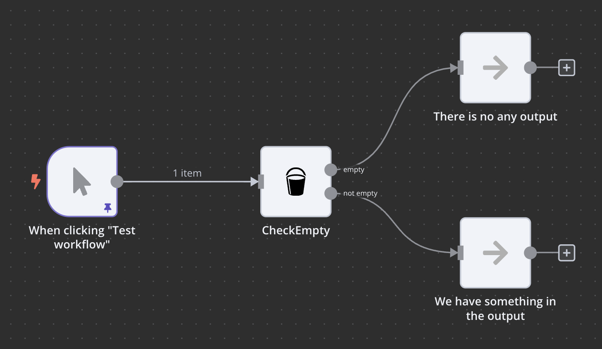

# n8n-nodes-checkempty

This is an n8n community node. It does a simple job, check the output of the previous node whether is empty or not.
If not empty, transfer the input to the output for the next node.

When you use it, make sure you turn on "Always Output Data" in the previous node's settings.

